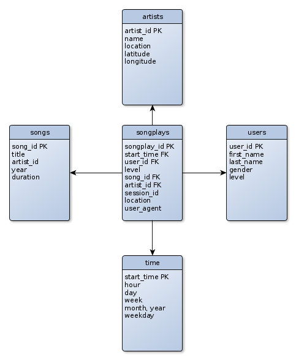

# project 1

## Project Overview
a basic description of the project. \
we have two type JSON sources: song data and log data. \
this project is to bring the JSON sources into a relational database (= etl).



## Project Repository files
* `create-tables.py`: create the database, drop previous tables and create tables
* `sql_queries.py`: kind of a DDL
* `etl.py`: here happens the magic: read json files, process and load (to db).

## How To Run the Project
* ensure your postgres is running or use a ready jupyter notebook
* then run `python create_tables.py`
* next run the ETL process: `python etl.py` 
* check the result with the following query (should return exactly 1 row: `songplay_is=483, song_id=SOZCTXZ12AB0182364, artist_id=AR5KOSW1187FB35FF4`)
```
SELECT * FROM songplays WHERE song_id is not null;
```


## Database and analytics goals
we created a relational database (postgres) in order to provide an easy way to query the data. 

## Database schema design
* we have one fact table: _songplays_. rest of the tables are dimension tables
* the design relies on the star schema. the fact tables has references (foreign keys) to dimension tables. by doing this we have relations to the tables.

## ETL pipeline
to bring our data (JSON files) to database we do ETL (extract, transform and load): \
* extract: load the data from songs and log data (JSON files)
* transform: distribute data to specific tables with dataframe, time transformation, ...
* load: insert into database

## Out of scope
__notes__
* JSON songs meta data resides under `songs_data/`
* JSON user activity (on app) data resides under `log_data/`

__definitions__
* _relational schema_: a logical definition of a table. like a blueprint.
* _database schema_: collection of the relational schemas for the hole database
