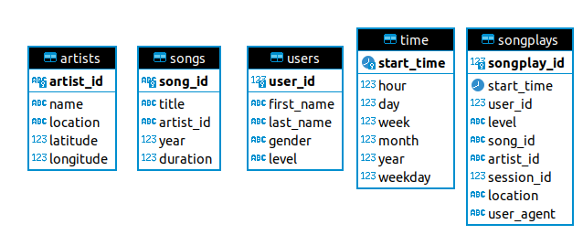

# Example: PostgreSQL and Python
* this example uses python, postgresql, pandas for transformation, json files, ...
* the python apps will load data from json files and inserts it to postgresql database
* the json files are located in `data/` folder
* ensure that you have a running posgresql database e.g. localhost:5432
* `create_tables.py` will connect first to `developer-db` 
    * then create a new database `pythondb`
    * on this db it will create tables
* `etl.py` will read data from the json files
    * transform data
    * insert data to tables

