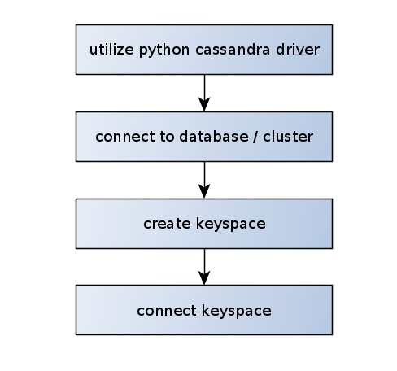

# project 2
https://github.com/leventarican/data-engineer-nd

* use ETL to extract our CSV dataset in __Apache Cassandra__

## Project Description
* Data Analysts want to know what songs the users are listening. Data resides as CSV.
* Perform data modeling with Apache Cassandra. Which can create queries on song play data.
* dataset `event_data` is partitioned by date:
```
event_data/2018-11-08-events.csv
event_data/2018-11-09-events.csv
```

## Apache Cassandra
* good approach: 1 table per 1 query
    * ex. if we have 2 queries then we need 2 different tables that partitioned the data differently
* there is no _join_ in apache cassandra. just denormalize tables (copy of data)
* a simple PRIMARY_KEY is also the PARTITION KEY. The PARTITION KEY will determine the distribution of data across the system
* _understand dataset fully_
* workflow of a basic python cassandra program

* Cassandra organizes data into partitions
* Partitions are stored in nodes
* Cassandra is a column data store. Like Apache HBase (also column oriented).
* __data with same partition will be in same node of a cluster__

### primary key, composite key, partition key, clustering key
```
PRIMARY KEY (a): The partition key is a.
PRIMARY KEY (a, b): The partition key is a, the clustering key is b.
PRIMARY KEY ((a, b)): The composite partition key is (a, b).
PRIMARY KEY (a, b, c): The partition key is a, the composite clustering key is (b, c).
PRIMARY KEY ((a, b), c): The composite partition key is (a, b), the clustering key is c.
PRIMARY KEY ((a, b), c, d): The composite partition key is (a, b), the composite clustering key is (c, d).
```

## Links
* cassandra datatypes: https://cassandra.apache.org/doc/latest/cql/types.html
* pandas dataframe: https://pandas.pydata.org/pandas-docs/stable/reference/api/pandas.DataFrame.html
* https://stackoverflow.com/questions/24949676/difference-between-partition-key-composite-key-and-clustering-key-in-cassandra
