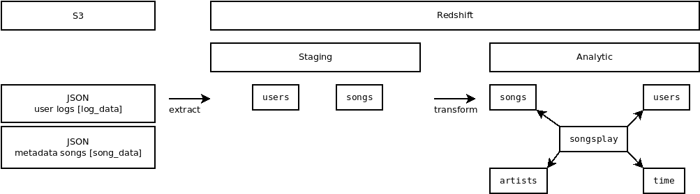
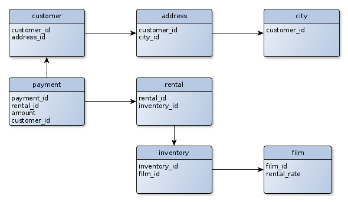
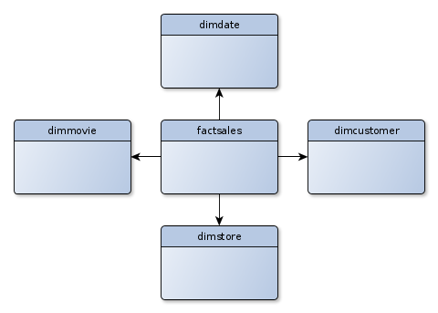

# Project 3
https://github.com/leventarican/data-engineer-nd

## Summary
* load data from S3 to staging tables on Redshift
* create the analytics tables from these staging tables



## How To Run the Project
PREREQUIREMENT: you have a AWS Redshift cluster

0. ensure to provide AWS credentials, with environment variables, config files, ...
1. run `create_tables.py`
2. run `etl.py`

## Project Repository files
* `create_tables.py`: connects to AWS Redshift (postgreSQL), drop tables, create tables
* `sql_queries.py`: kind of a DDL
    * CREATE staging tables
    * CREATE fact and dimension tables
    * COPY: read json data from s3 (Redshift COPY is very _powerful_)
    * INSERT: transform from staging table to dact/dimension table
* `etl.py`: connects to AWS Redshift, loads `log_data` and `song_data` to staging tables and transform them into star schema fact & dimension tables

## Additional Information

### Datasets
* __log_data__ / events JSON example: logs on user activity
```
{
    "artist": "Des'ree",
    "auth": "Logged In",
    "firstName": "Kaylee",
    "gender": "F",
    "itemInSession": 1,
    "lastName": "Summers",
    "length": 246.30812,
    "level": "free",
    "location": "Phoenix-Mesa-Scottsdale, AZ",
    "method": "PUT",
    "page": "NextSong",
    "registration": 1540344794796.0,
    "sessionId": 139,
    "song": "You Gotta Be",
    "status": 200,
    "ts": 1541106106796,
    "userAgent": "\"Mozilla\/5.0 (Windows NT 6.1; WOW64) AppleWebKit\/537.36 (KHTML, like Gecko) Chrome\/35.0.1916.153 Safari\/537.36\"",
    "userId": "8"
}
```
* __song_data__ JSON example: metadata on songs
```
{
    "num_songs": 1,
    "artist_id": "ARJIE2Y1187B994AB7",
    "artist_latitude": null,
    "artist_longitude": null,
    "artist_location": "",
    "artist_name": "Line Renaud",
    "song_id": "SOUPIRU12A6D4FA1E1",
    "title": "Der Kleine Dompfaff",
    "duration": 152.92036,
    "year": 0
}
```

### AWS

#### AWS SDK
* python: _boto3_
* create one IAM user for the connection

### Examples
* for the examples the sakila / pagila (MySQL, Postgres) sample database is used
* do some _data analysis_ to find some _insights_

#### 1. Work on a 3NF schema


#### 2. Work on a star schema
* composed with _fact_ and _dimension_ tables



### Links
* https://dev.mysql.com/doc/sakila/en/sakila-structure.html
* https://github.com/devrimgunduz/pagila

#### PosgreSQL vs Reshift
* https://docs.aws.amazon.com/redshift/latest/dg/c_redshift-and-postgres-sql.html

#### COPY
* https://www.postgresql.org/docs/current/sql-copy.html
* https://docs.aws.amazon.com/redshift/latest/dg/r_COPY_command_examples.html#r_COPY_command_examples-copy-from-json
* https://docs.aws.amazon.com/redshift/latest/dg/copy-parameters-data-conversion.html

#### CREATE TABLE
* https://docs.aws.amazon.com/redshift/latest/dg/r_CREATE_TABLE_examples.html

#### Redshift datatypes
* https://docs.aws.amazon.com/redshift/latest/dg/c_Supported_data_types.html

#### ETL with Hive, Spark
* https://knowledge.udacity.com/questions/420591
* https://www.softkraft.co/python-with-hive
* https://www.cdata.com/kb/tech/hive-python-petl.rst
* https://dzone.com/articles/example-of-etl-application-using-apache-spark-and
