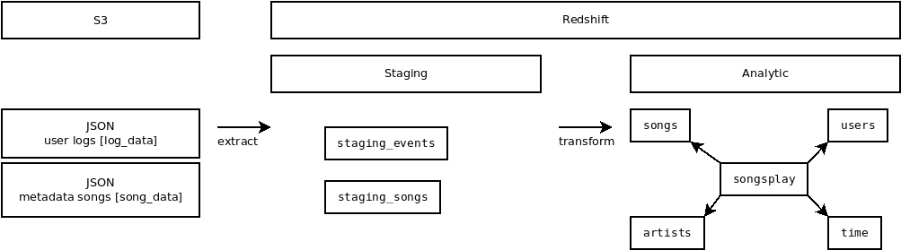

# Project 3
https://github.com/leventarican/data-engineer-nd

## Summary
* load data from S3 to staging tables on Redshift
* create the analytics tables from these staging tables

## How To Run the Project
PREREQUIREMENT: you have a AWS Redshift cluster
1. run `create_tables.py`
2. run `etl.py`

## Project Repository files
* `create_tables.py`: connects to AWS Redshift (postgreSQL), drop tables, create tables
* `sql_queries.py`: kind of a DDL
    * create staging tables
    * create fact and dimension tables
* `etl.py`: connects to AWS Redshift, loads `log_data` and `song_data` to staging tables and transform them into star schema fact & dimension tables

## Additional Information

### AWS

#### AWS SDK
* python: _boto3_
* create one IAM user for the connection

### Examples
* for the examples the sakila / pagila (MySQL, Postgres) sample database is used
* do some _data analysis_ to find some _insights_

#### 1. Work on a 3NF schema

#### 2. Work on a star schema
* composed with _fact_ and _dimension_ tables

### Links
* https://dev.mysql.com/doc/sakila/en/sakila-structure.html
* https://github.com/devrimgunduz/pagila

## COPY
* https://www.postgresql.org/docs/current/sql-copy.html
* https://docs.aws.amazon.com/redshift/latest/dg/r_COPY_command_examples.html#r_COPY_command_examples-copy-from-json

## CREATE TABLE
* https://docs.aws.amazon.com/redshift/latest/dg/r_CREATE_TABLE_examples.html
