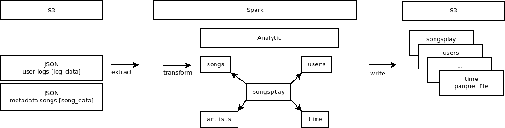

# Project 4
https://github.com/leventarican/data-engineer-nd

## Summary
* load data from json files to partitioned parquet files on S3



## How To Run the Project
PREREQUIREMENT: running spark cluster

0. ensure to provide AWS credentials, with environment variables, config files, ...
1. run `etl.py`

## Project Repository files
* `etl.py`: extracts data from S3, transform data to analytics tables, write partitioned parquet files in table directories on S3.

## Additional Information

### Create EMR from AWS management console
1. create SSH key-pair
* for the EC2 login / secure connection via ssh (openssl)
* private key (encrypted) for the user and public key (unencrypted PEM encoded) for instance
* go to EC2 > Key Pairs > Create Key Pair > give a name and download the `.pem` file 
2. create EMR cluster
* give a cluster name
* select release version 5.20.0 with Spark 2.40.0
* select the EC2 key pair you created
* https://aws.amazon.com/emr/pricing/
3. connect to EMR cluster via notebook
* go to EMR > Notebooks > create > select your cluster
* open notebook and select _PySpark_ kernel
4. Terminate cluster
* go to EMR > select cluster > Terminate

### AWS CLI
* download, unzip, update environment variable `$PATH` to `aws/dist` 
```
curl "https://awscli.amazonaws.com/awscli-exe-linux-x86_64.zip" -o "awscliv2.zip"

unzip awscliv2.zip

aws --version
aws-cli/2.1.15 Python/3.7.3 Linux/5.4.0-58-generic exe/x86_64.ubuntu.20 prompt/off
```
* before you can use aws you need to configure it: access keys, ...
* you need the create the access keys: access key id and secret access key. download it: a `.csv` file
```
aws configure list
aws configure --profile default
```
* get cluster description (as json)
```
aws emr describe-cluster --cluster-id <THE-CLUSTER-ID>
```
* you can also create an EMR cluster 
* with `--auto-terminate` the cluster will terminate automatically after jobs are done
```
aws emr create-cluster --name <THE-EMR-CLUSTERNAME> --use-default-roles --release-label emr-5.28.0 --instance-count 3 --applications Name=Spark  --ec2-attributes KeyName=<THE-EC2-KEYPAIR> --instance-type m5.xlarge --instance-count 3 --auto-terminate
```

#### Links
* https://docs.aws.amazon.com/cli/latest/userguide/cli-chap-welcome.html
