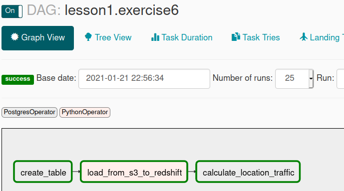
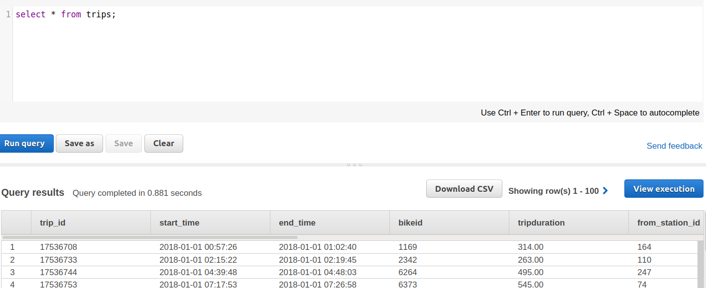

# Project 6
https://github.com/leventarican/data-engineer-nd

* automate and monitor data warehouse ETL pipeline with Apache Airflow
* source dataset
    * JSON logs (user activity)
    * JSON metadata (songs the users listen to)
* stage data from S3 to Redshift (`copy` statement)

## Additional Information

### Apache Airflow
* automation and monitoring for data warehouse ETL

### Example: Apache Airflow DAG
* example 6 / `code5.py`
* task: create table in redshift
* task: load data from s3 to redshift
* task: calculate location traffic

