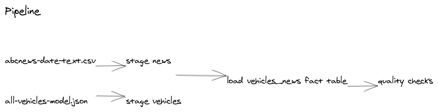

# Data Engineering Capstone Project
* github repository: https://github.com/leventarican/data-engineer-nd/tree/main/project8

#### Project Summary
~~--describe your project at a high level--~~

We have a data source with __news headlines__ from 2003 to 2020. Our interest is to find headlines from car manufacturers and show the models in the headline year. For that purpose we have a second data source with a list of __car__ brands from 1984 to 2020.
Our use case is for a given car manufacturer and year to show the headlines and the car model in that year.
As an example we took ferrari and the headlines in 2012.

The project follows the follow steps:
* Step 1: Scope the Project and Gather Data
* Step 2: Explore and Assess the Data
* Step 3: Define the Data Model
* Step 4: Run ETL to Model the Data
* Step 5: Complete Project Write Up


```python
import os
from pyspark.sql import SparkSession
from pyspark.sql.types import StringType
from pyspark.sql.functions import udf
from pyspark.sql.functions import lower, col
from pyspark.sql.functions import asc
```

### Step 1: Scope the Project and Gather Data

#### Scope 
~~Explain what you plan to do in the project in more detail. What data do you use? What is your end solution look like? What tools did you use? etc>~~

We have two different data source:
* `abcnews-date-text.csv` with over 1 million headlines. 
* `all-vehicles-model.json` with over 40k datasets from car brands / models
These two data sources resides within the workspace in the `data/` folder.

For the processing we are using Apache Spark. We load (incl. schema inferering) the data and save it as parquet files partitioned by year. The parquet files resides in the `data/` folder:
* `news/` parquet files for news headlines dataset
* `vehicles/` parquet files for vehicles dataset
Afterwards we load the parquet file, transform it in order to have to the structure we can query. 

#### Describe and Gather Data 
~~Describe the data sets you're using. Where did it come from? What type of information is included? ~~

##### Dataset 1: vehicles
* Source of the dataset is: https://public.opendatasoft.com/explore/dataset/all-vehicles-model/information/

###### Example Entry
| Make   | Model   | Year | Drive                      | Cylinders | Engine displacement | ... |
|--------|---------|------|----------------------------|-----------|---------------------|-----|
| Toyota | Corolla | 1989 | 4-Wheel or All-Wheel Drive | 4         | 1.6                 | ... |

##### Dataset 2: news headlines
* Source of the dataset is: https://www.kaggle.com/therohk/million-headlines?select=abcnews-date-text.csv

###### Example Entry
| publish_date | headline_text                                      |
|--------------|----------------------------------------------------|
| 20030219     | aba decides against community broadcasting licence |

#### Dataset 1/2: vehicles


```python
spark = SparkSession.builder.appName("Data Engineer - Capstone").getOrCreate()
```


```python
df = spark.read.json("data/all-vehicles-model.json")
```


```python
df.printSchema()
```

    root
     |-- datasetid: string (nullable = true)
     |-- fields: struct (nullable = true)
     |    |-- atvtype: string (nullable = true)
     |    |-- barrels08: double (nullable = true)
     |    |-- barrelsa08: double (nullable = true)
     |    |-- c240bdscr: string (nullable = true)
     |    |-- c240dscr: string (nullable = true)
     |    |-- charge120: double (nullable = true)
     |    |-- charge240: double (nullable = true)
     |    |-- charge240b: double (nullable = true)
     |    |-- city08: long (nullable = true)
     |    |-- city08u: double (nullable = true)
     |    |-- citya08: long (nullable = true)
     |    |-- citya08u: double (nullable = true)
     |    |-- citycd: double (nullable = true)
     |    |-- citye: double (nullable = true)
     |    |-- cityuf: double (nullable = true)
     |    |-- co2: long (nullable = true)
     |    |-- co2a: long (nullable = true)
     |    |-- co2tailpipeagpm: double (nullable = true)
     |    |-- co2tailpipegpm: double (nullable = true)
     |    |-- comb08: long (nullable = true)
     |    |-- comb08u: double (nullable = true)
     |    |-- comba08: long (nullable = true)
     |    |-- comba08u: double (nullable = true)
     |    |-- combe: double (nullable = true)
     |    |-- combinedcd: double (nullable = true)
     |    |-- combineduf: double (nullable = true)
     |    |-- createdon: string (nullable = true)
     |    |-- cylinders: long (nullable = true)
     |    |-- displ: double (nullable = true)
     |    |-- drive: string (nullable = true)
     |    |-- eng_dscr: string (nullable = true)
     |    |-- engid: string (nullable = true)
     |    |-- evmotor: string (nullable = true)
     |    |-- fescore: long (nullable = true)
     |    |-- fuelcost08: long (nullable = true)
     |    |-- fuelcosta08: long (nullable = true)
     |    |-- fueltype: string (nullable = true)
     |    |-- fueltype1: string (nullable = true)
     |    |-- fueltype2: string (nullable = true)
     |    |-- ghgscore: long (nullable = true)
     |    |-- ghgscorea: long (nullable = true)
     |    |-- guzzler: string (nullable = true)
     |    |-- highway08: long (nullable = true)
     |    |-- highway08u: double (nullable = true)
     |    |-- highwaya08: long (nullable = true)
     |    |-- highwaya08u: double (nullable = true)
     |    |-- highwaycd: double (nullable = true)
     |    |-- highwaye: double (nullable = true)
     |    |-- highwayuf: double (nullable = true)
     |    |-- hlv: long (nullable = true)
     |    |-- hpv: long (nullable = true)
     |    |-- id: string (nullable = true)
     |    |-- lv2: long (nullable = true)
     |    |-- lv4: long (nullable = true)
     |    |-- make: string (nullable = true)
     |    |-- mfrcode: string (nullable = true)
     |    |-- model: string (nullable = true)
     |    |-- modifiedon: string (nullable = true)
     |    |-- mpgdata: string (nullable = true)
     |    |-- phevblended: string (nullable = true)
     |    |-- phevcity: long (nullable = true)
     |    |-- phevcomb: long (nullable = true)
     |    |-- phevhwy: long (nullable = true)
     |    |-- pv2: long (nullable = true)
     |    |-- pv4: long (nullable = true)
     |    |-- range: long (nullable = true)
     |    |-- rangea: string (nullable = true)
     |    |-- rangecity: double (nullable = true)
     |    |-- rangecitya: double (nullable = true)
     |    |-- rangehwy: double (nullable = true)
     |    |-- rangehwya: double (nullable = true)
     |    |-- scharger: string (nullable = true)
     |    |-- startstop: string (nullable = true)
     |    |-- tcharger: string (nullable = true)
     |    |-- trans_dscr: string (nullable = true)
     |    |-- trany: string (nullable = true)
     |    |-- ucity: double (nullable = true)
     |    |-- ucitya: double (nullable = true)
     |    |-- uhighway: double (nullable = true)
     |    |-- uhighwaya: double (nullable = true)
     |    |-- vclass: string (nullable = true)
     |    |-- year: string (nullable = true)
     |    |-- yousavespend: long (nullable = true)
     |-- record_timestamp: string (nullable = true)
     |-- recordid: string (nullable = true)
    


```python
df1 = df.select(df["fields"]["make"], df["fields"]["model"], df["fields"]["cylinders"], df["fields"]["year"])
vehicles_table = df1.toDF("brand", "model", "cylinders", "year")
vehicles_table.show(10)
```

    +----------+-------------------+---------+----+
    |     brand|              model|cylinders|year|
    +----------+-------------------+---------+----+
    |       BMW|              750il|       12|1993|
    |     Dodge|B150/B250 Wagon 2WD|        8|1985|
    |  Chrysler|         New Yorker|        6|1993|
    |     Mazda|                929|        6|1993|
    |   Pontiac|         Grand Prix|        6|1993|
    |     Volvo|                850|        5|1993|
    |     Buick|      Century Wagon|        6|1993|
    |Mitsubishi|               Expo|        4|1993|
    |Volkswagen|       Passat Wagon|        6|1993|
    |       GMC|         Sonoma 2WD|        6|1993|
    +----------+-------------------+---------+----+
    only showing top 10 rows
    


```python
vehicles_table.printSchema()
```

    root
     |-- brand: string (nullable = true)
     |-- model: string (nullable = true)
     |-- cylinders: long (nullable = true)
     |-- year: string (nullable = true)
    


#### Dataset 2/2: news


```python
df = spark.read.csv("data/abcnews-date-text.csv", header=True, mode="DROPMALFORMED", sep=",")
```


```python
df.printSchema()
```

    root
     |-- publish_date: string (nullable = true)
     |-- headline_text: string (nullable = true)
    


```python
get_year = udf(lambda d: d[0:4], StringType())
news_table = df.withColumn("year", get_year(df["publish_date"]))
news_table.show(10)
```

    +------------+--------------------+----+
    |publish_date|       headline_text|year|
    +------------+--------------------+----+
    |    20030219|aba decides again...|2003|
    |    20030219|act fire witnesse...|2003|
    |    20030219|a g calls for inf...|2003|
    |    20030219|air nz staff in a...|2003|
    |    20030219|air nz strike to ...|2003|
    |    20030219|ambitious olsson ...|2003|
    |    20030219|antic delighted w...|2003|
    |    20030219|aussie qualifier ...|2003|
    |    20030219|aust addresses un...|2003|
    |    20030219|australia is lock...|2003|
    +------------+--------------------+----+
    only showing top 10 rows
    


```python
news_table.printSchema()
```

    root
     |-- publish_date: string (nullable = true)
     |-- headline_text: string (nullable = true)
     |-- year: string (nullable = true)
    


### Step 2: Explore and Assess the Data
#### Explore the Data 
Identify data quality issues, like missing values, duplicate data, etc.

#### Cleaning Steps
Document steps necessary to clean the data


```python
vehicles_table.count()
```


    41443


```python
news_table.count()
```


    1082168


```python
vehicles_table = vehicles_table.distinct()
vehicles_table.count()
```


    22836


```python
news_table = news_table.distinct()
news_table.count()
```


    1082168


```python
vehicles_table.write.partitionBy("year").mode("overwrite").parquet(os.path.join("data", "vehicles"))
news_table.write.partitionBy("year").mode("overwrite").parquet(os.path.join("data", "news"))
```

### Step 3: Define the Data Model
#### 3.1 Conceptual Data Model
~~Map out the conceptual data model and explain why you chose that model~~

We create a fact table `vehicles_news` which contains the information for detailed car (model, cylinder, year, ...) with a relation to news in same year.

#### 3.2 Mapping Out Data Pipelines
~~List the steps necessary to pipeline the data into the chosen data model~~

For the fact table `vehicles_news` we perform the following steps:
1. load the staging tables (parquet files)
2. for each create temporary views
3. create a dataframe from `vehicles` and `news` with a join on `year`
4. create the desired dataframe for ferrari and write as parquet file



### Step 4: Run Pipelines to Model the Data 
#### 4.1 Create the data model
Build the data pipelines to create the data model.


```python
df = spark.read.parquet("data/vehicles")
```


```python
df.count()
```


    22836


Check data


```python
df.createOrReplaceTempView("vehicles")
vehicles = spark.sql("""
select * from vehicles where int(year) > 2003
order by int(year) asc
""")
vehicles.show(1)
```

    +--------+--------------------+---------+----+
    |   brand|               model|cylinders|year|
    +--------+--------------------+---------+----+
    |Chrysler|Town and Country/...|        6|2004|
    +--------+--------------------+---------+----+
    only showing top 1 row
    


```python
df = spark.read.parquet("data/news")
```


```python
df.createOrReplaceTempView("news")
news = spark.sql("""
select * from news where int(year) > 2003
order by int(year) asc
""")
news.show(1)
```

    +------------+--------------------+----+
    |publish_date|       headline_text|year|
    +------------+--------------------+----+
    |    20040102|sheep exports thr...|2004|
    +------------+--------------------+----+
    only showing top 1 row
    


Create `vehicles_news` dataframe from `vehicles` and `news` with join on `year` and filter headlines with car manufacturers.


```python
vehicle_news = vehicles.join(news, on="year", how='left').filter(news.headline_text.contains(lower(vehicles.brand))).distinct()
```


```python
ferrari_2012 = vehicle_news\
.filter(col("year").like("%2012%"))\
.filter(col("brand").like("%Ferrari%"))\
.orderBy(asc("publish_date"))

ferrari_2012.show(10)
```

    +----+-------+-----------------+---------+------------+--------------------+
    |year|  brand|            model|cylinders|publish_date|       headline_text|
    +----+-------+-----------------+---------+------------+--------------------+
    |2012|Ferrari|458 Italia Spider|        8|    20120118|out of control fe...|
    |2012|Ferrari| 458 Italia Coupe|        8|    20120118|out of control fe...|
    |2012|Ferrari|       California|        8|    20120118|out of control fe...|
    |2012|Ferrari|               FF|       12|    20120118|out of control fe...|
    |2012|Ferrari|458 Italia Spider|        8|    20120120|charges laid over...|
    |2012|Ferrari| 458 Italia Coupe|        8|    20120120|charges laid over...|
    |2012|Ferrari|               FF|       12|    20120120|charges laid over...|
    |2012|Ferrari|       California|        8|    20120120|charges laid over...|
    |2012|Ferrari|       California|        8|    20120305|ferrari wont plac...|
    |2012|Ferrari|               FF|       12|    20120305|ferrari wont plac...|
    +----+-------+-----------------+---------+------------+--------------------+
    only showing top 10 rows
    


```python
vehicle_news.write.partitionBy("year").mode("overwrite").parquet(os.path.join("data", "vehicles_news"))
```

#### 4.2 Data Quality Checks
Explain the data quality checks you'll perform to ensure the pipeline ran as expected. These could include:
 * Integrity constraints on the relational database (e.g., unique key, data type, etc.)
 * Unit tests for the scripts to ensure they are doing the right thing
 * Source/Count checks to ensure completeness
 
Run Quality Checks


```python
if vehicle_news.count() > 0:
    print("SUCCESS: check 0")
else:
    print("FAILED: check 0")

if os.path.exists('./data/vehicles_news') > 0:
    print("SUCCESS: check 1")
else:
    print("FAILED: check 1")
```

    SUCCESS: check 0
    SUCCESS: check 1


#### 4.3 Data dictionary 
Create a data dictionary for your data model. For each field, provide a brief description of what the data is and where it came from. You can include the data dictionary in the notebook or in a separate file.

##### Data Model

| column        | description                                |
|---------------|--------------------------------------------|
| year          | model year in yyyy                         |
| brand         | manufacturer (division)                    |
| model         | model name (carline)                       |
| publish_date  | date of publishing in yyyyMMdd             |
| headline_text | news headline text ascii english lowercase |

#### Step 5: Complete Project Write Up
* Clearly state the rationale for the choice of tools and technologies for the project.
> By using Spark we can wrangle big data in memory which is efficient. We also store the data as parquet files. For latere analtics this open us the door to load the data to Amazon S3 and analyze data on AWS Redshift.
* Propose how often the data should be updated and why.
> If we want to get up-to-date data then we should load daily news
* Write a description of how you would approach the problem differently under the following scenarios:
 * The data was increased by 100x.
 * The data populates a dashboard that must be updated on a daily basis by 7am every day.
 * The database needed to be accessed by 100+ people.
> We can load data to the Cloud e.g. AWS. For storage we use S3, for analytics / access Redshift and for daily updates we can write a Apache Airflow pipeline by using the scheduler component.
