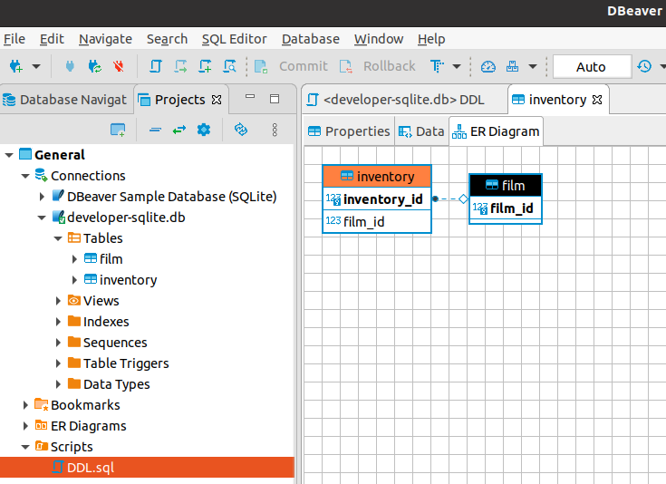

# SQLite

* use a sqlite database for quick exploration
* `create-database.py` show how to create an empty db within python
* DBeaver is a good database tool. you can also connect to the sqlite database and do db operations: create table, select, ... It can also create an ER diagram (ERD) from the tables.

## Links
* https://dbeaver.io/download/
